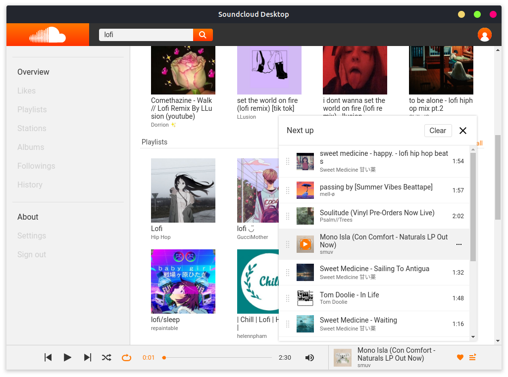
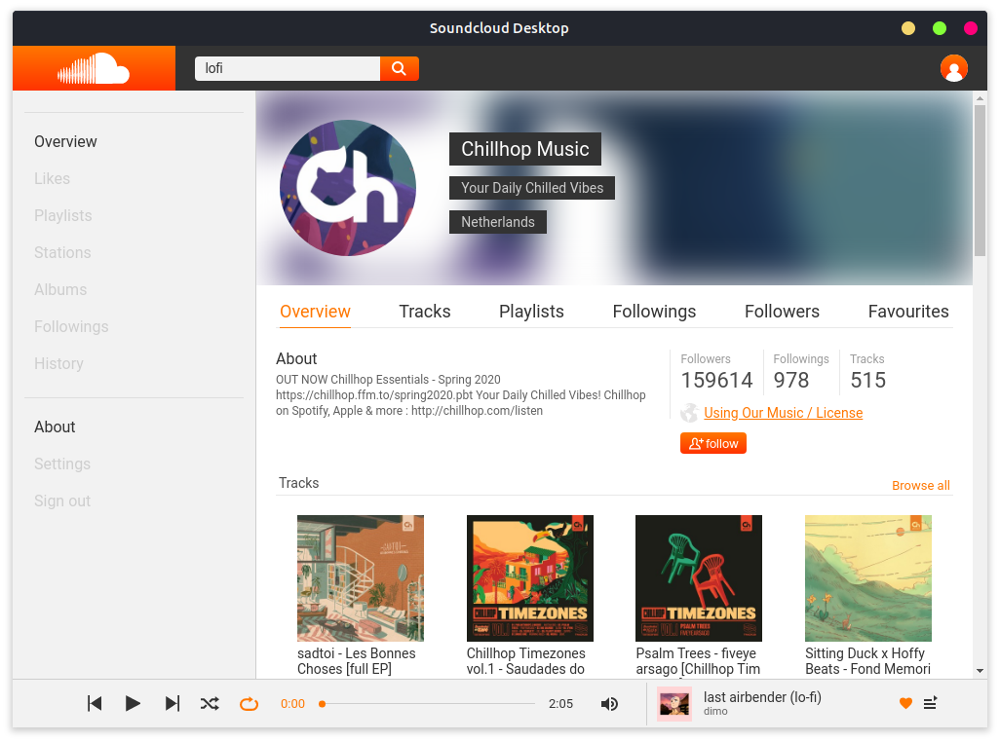
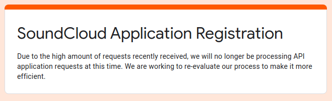

# SoundCloud Desktop :headphones:
> SoundCloud desktop is a hobby made project created by [Karol Waliszewski](https://github.com/Karol-Waliszewski). The reason why this application is being made is because I was tired of my SoundCloud page drowning into my browser's tabs, but unfortunately there is no official desktop application. So I decided to give it a try and with available API do one by myself.

## Screenshots :camera: 

Track, Playlists and Users browser

Easily manageable queue with drag and drop support

User informations on profile page

## Development :wrench:

+ All the designs were made by me in the [Adobe Experience Desing](https://www.adobe.com/products/xd.html).

+ Desktop experience is brought by [Electron](https://www.electronjs.org/).

+ As a front-end framework I choose [React](https://reactjs.org/).

+ [Redux](https://redux.js.org/) helped to manage entire application states.

+ Entire music streaming and fetching is available thanks to open [SoundCloud API](https://developers.soundcloud.com/).

## Difficulties :nut_and_bolt:
Right not i'm unable to create authentication, which will bring user profiles (preferences) to the application, because SoundCloud disabled registration of new applications.

## Meta

Karol Waliszewski – [karolwaliszewski@gmail.com](mailto:karolwaliszewski@gmail.com)

https://github.com/Karol-Waliszewski
